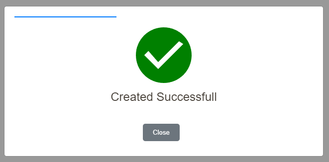
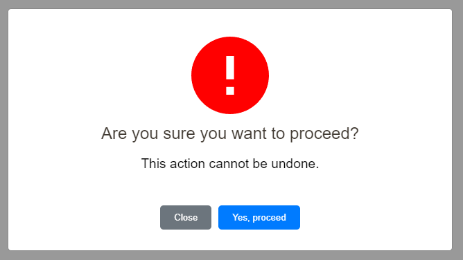
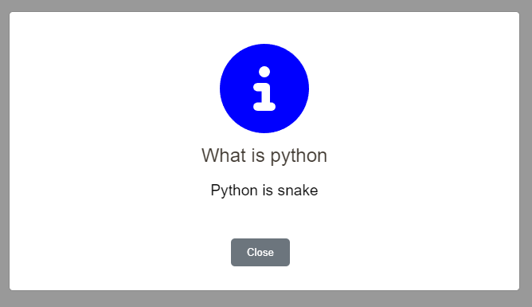
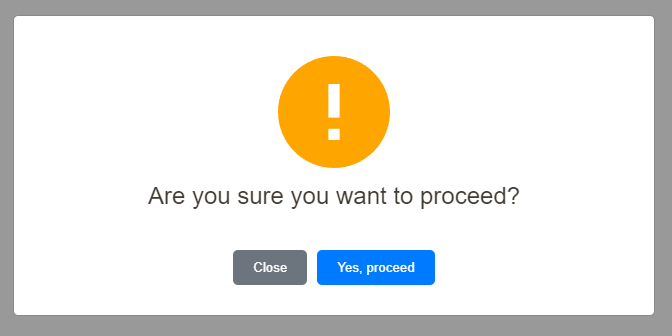
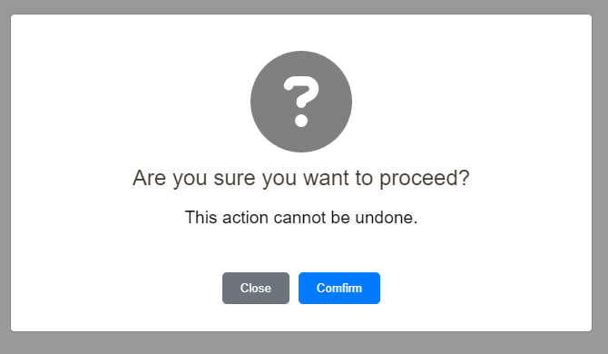

# Yoyo Popup


[View Demo](https://smallvi.github.io/yoyoPopup/)

## Introduction

Yoyo Popup is a customizable alert popup plugin that works without any dependencies. It's designed to be easy to use and highly customizable, allowing you to create stylish and functional alert popups for your website or application.

## Screenshot







## Installation

- #### Download

```html
<script src="path/to/yoyoPopup.min.js"></script>
```

- #### CDN

```html
<script src="https://cdn.jsdelivr.net/gh/smallvi/yoyoPopup/dist/yoyoPopup.min.js"></script>
```

## Usage
    
    ### Simple Yoyo Popup Alert

    ```javascript
    showYoyoPopup({
        text: 'Done',
        type: 'success',
    });
    ```

    ### Advance Yoyo Popup Alert

    ```javascript
    showYoyoPopup({
        text: 'Are you sure you want to proceed?',
        subtext: 'This action cannot be undone.',
        type: 'danger',
        isStatic: true,
        hasConfirmation: true,
        hasCancellation: true,
        confirmLabel: 'Yes, proceed',
        cancelLabel: 'Cancel',
        closeLabel: 'Close',
        formId: '',
        timeOut: 5000,
        confirmFunction: ()=> functionConfirm(),
        cancelFunction: ()=> functionCancel(),
        closeFunction: () => alert('You click Close'),
    });
    ```

## Param

- text: Main Text
- subtext: Sub Text
- type: Icon type {'info','question','success','warning','danger'}

- title: Optional
- isStatic: Boolean indicating if the popup is static (click outside to close),
- hasConfirmation: Boolean indicating if the popup has confirm button,
- hasCancellation: Boolean indicating if the popup has cancel button,
- confirmLabel: Label of confirm button,
- cancelLabel: Label of cancel button,
- closeLabel: Label of close button,
- formId: Form ID to submit,
- confirmFunction: Function name to call if press confirm button,
- cancelFunction: Function name to call if press cancel button,
- closeFunction: Function name to call if press close button,
- timeOut: auto close modal (1000 = 1 sec),

## License

This project is licensed under the MIT License - see the [LICENSE](LICENSE) file for details.